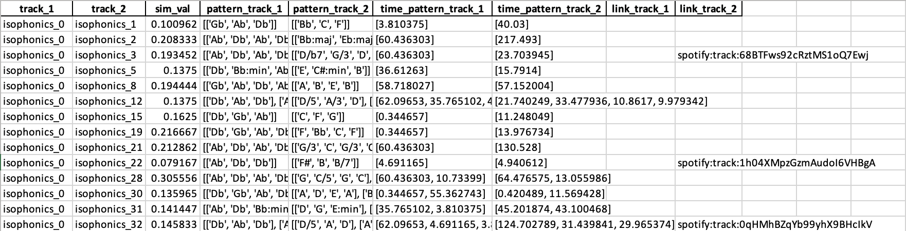
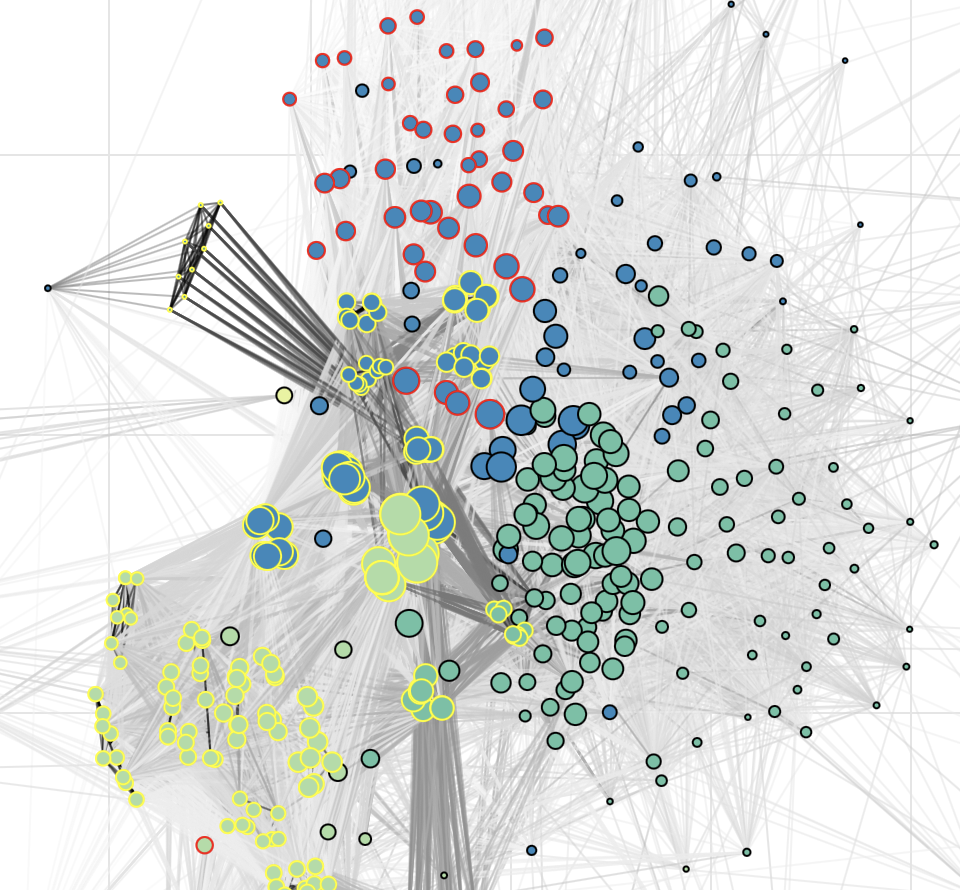
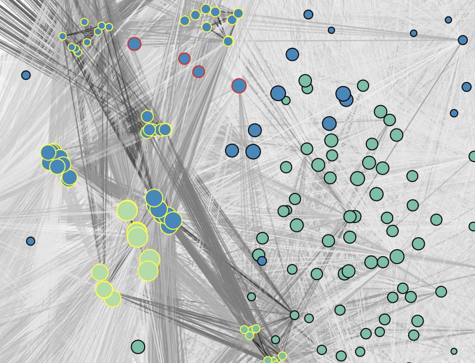
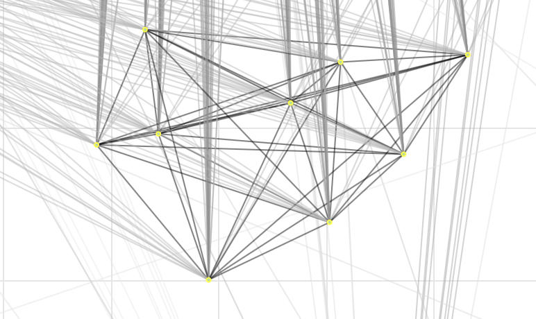

# Harmonic similarity validation

This folder provides 3 files that are useful for analysing the harmonic properties that tracks in our datasets have in common, and for validating our current *harmonic similarity* function through manual inspection. Here we provide some documentation about these files so that the experimenter can familiarise with the validation framework we have in mind.

Reminder: for the SONAR experiment, we are focusing on 3 music datasets that provide chord annotations. These are:
- Isophonics (pop music from The Beatles, Queen, and Michael Jackson);
- JAAH (jazz music, various artists);
- Schubert Winterreise (all the 24 movements of the song cycle -- voice and piano )

## Metadata

To simplify the visualisation utilities and the inspection of the "harmonic matches", we use track IDs rather than their full names. Therefore, the first file you should always keep opened is `sonar_datasets_meta.csv`. As you can see from the fragment reported below, this file lists all the tracks that were included in our study and provides information regarding the **title** and the **artist** of each of them. This will be useful for you because all the other files in this directory make use of the ID associated to each track.

```
id, title, artist, path
isophonics_0, 09_-_When_I'm_Sixty-Four, The Beatles, ../../datasets/annotations/isophonics/Isophonics_09_-_When_I'm_Sixty-Four.jams
```

NB: the naming convention for the ID already makes it easier to understand from which music dataset (from the 3 listed above) a track comes from. This is already useful when inspecting the harmonic similarities between 2 songs of totally different genre.

## Harmonic matches

This is the most important file to take into account, as it collects all the couples of tracks for which their harmonic similarity is non-zero -- meaning that they share a recurrent harmonic pattern (a portion of their harmonic progressions). You can find it at `.\harmonic_similarity_matches.xlsx` (currently in `.xlsx` format to make the inspection tidier). Therefore, if 2 tracks "track_x" and "track_y" do not have any harmonic pattern in common, you will not find the (track_x, track_y) entry in this spreadsheet, as their similarity value would be 0. *You still want to see these non-matches? Hold on, we have a surprise for you later.*

<p align="center">

</p>

As you can see from the figure above, for each **harmonic match** (a non-zero harmonic similarity among 2 tracks) we report the following information.
- The value of harmonic similarity among the 2 tracks (sim_val): a float ranging in the (0, 1] interval; the higher sim_val, the higher their harmonic similarity. NB: in the extreme case that sim_val = 1, this does not mean that the 2 tracks have identical progressions (see our definition of harmonic similarity for more info).
- For each track, the longest portion of their harmonic progression they have in common. When looking at harmonic matches, we only look at the decomposition of chords into their note constituents. In addition, we transpose harmonic progressions to the same tonality (Cmaj), so that our criteria for matching are more consistent. Therefore, `pattern_track_1` and `pattern_track_2` can be different!
- The time stamp where the 2 recurring patterns (in common) occur in the audio recordings. This is useful for validation.
- Finally, we also provide the Spotify URIs of some tracks where these patterns can be listened. To open the URIs, you need to copy and paste them into your browser and move to the time slot indicated in the "time_pattern_track_X" column. As for tracks without URIs, you will have to manually search the track; in this case, however, the correctness of the time stamp cannot be guaranteed.

## The harmonic network

To conlcude, you may want to visualise all the harmonic matches in a more compact way, so that you will be able to **spot interesting connections**. This is possible thanks to our interactive harmonic network, which can be visualised and inspected at `graph.html` (you can simply open this file with your browser, just make sure that the actual extension on your file system in `.html` and not `.html.txt` for example). Once you open the file, the graph might appear very condensed in a region, but you can zoom and interact with it.

<p align="center">

</p>

In the graph, each node corresponds to a track in our music datasets, whereas edges connect nodes if their value of harmonic similarity is greater than 0 (an harmonic match was found). A colourmap is used for edges in order to visually project the value of harmonic similarity they express: from *light grey* (low similarity) to *plain black* (high similarity). Instead, nodes are sized according to their **degree** (the number of connections/edges they have) and coloured according to their **community class**. This last information associates each node (track) to a cluster based on a community detection algorithm that was run on the network (the standard Clauset-Newman-Moore modularity maximisation procedure).

<p align="center">

</p>

<p align="center">

</p>